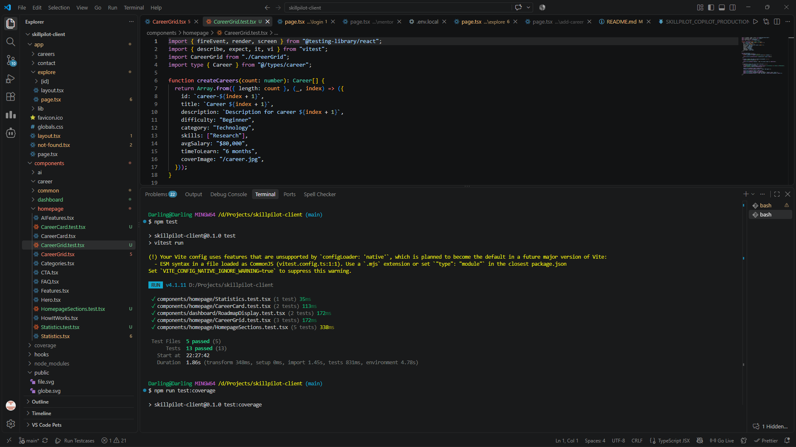
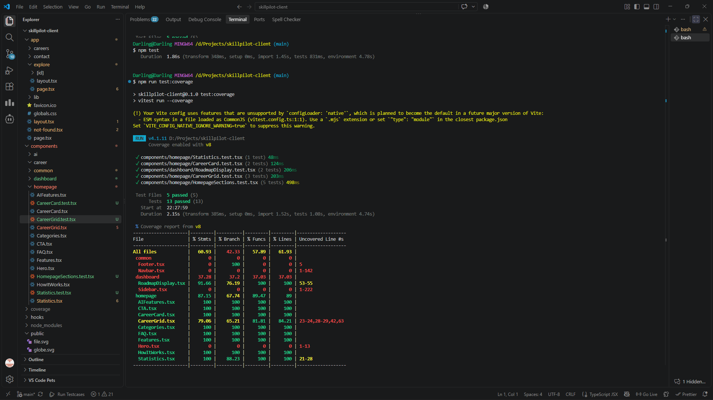
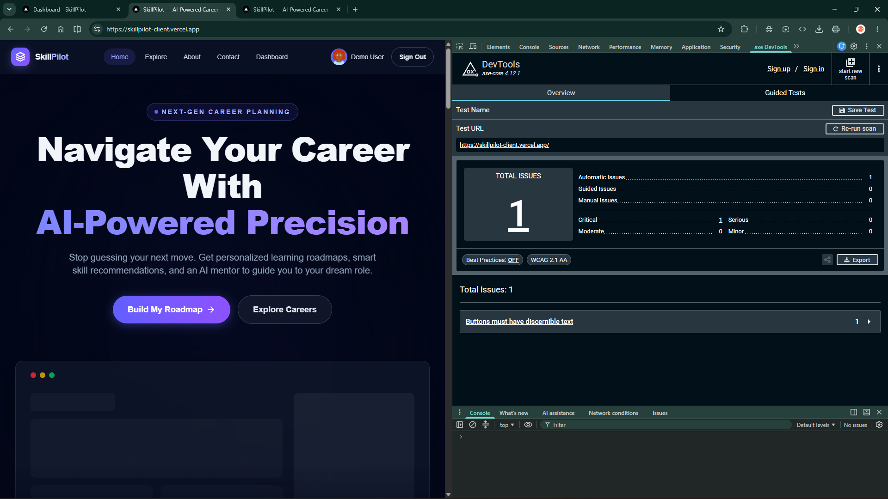
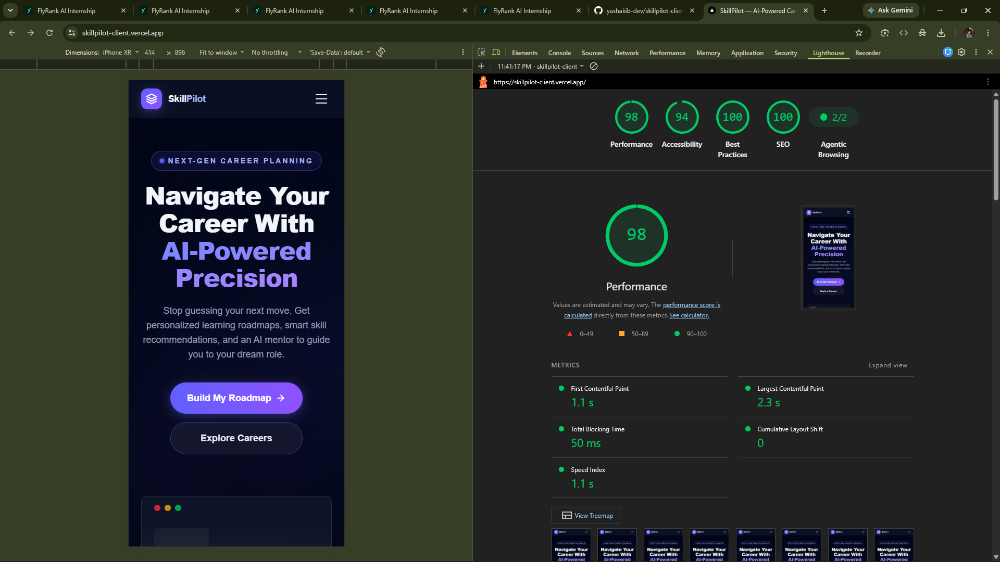
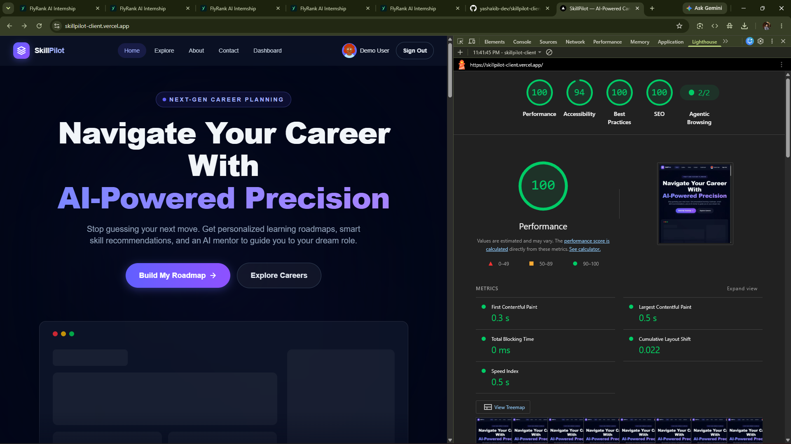

# SkillPilot - AI-powered Career Roadmap Generator & AI Assistant

SkillPilot is an AI-powered career planning platform built with Next.js, React, TypeScript, and Better Auth. It helps users discover careers, create personalized learning goals, generate AI roadmaps, track their progress, and chat with an AI career mentor for guidance.

This repository contains the frontend client only. The app integrates with a separate backend server for career data and AI roadmap generation.

## Live Application

- Production frontend: https://skillpilot-client.vercel.app
- Production backend: https://skillpilot-server-pc4b.onrender.com

## Repository

- Frontend repository: https://github.com/yashakib-dev/skillpilot-client

## Project Brief

SkillPilot addresses the problem of fragmented career-planning resources by giving aspiring and transitioning professionals a structured path from career discovery to measurable learning progress; it is aimed at students, career changers, and professionals who want practical guidance, and was chosen as a capstone project because it combines a real user need with authentication, data-driven workflows, AI assistance, and a complete responsive frontend experience.

---

## Overview

SkillPilot is designed for people who want a more structured and actionable path into a career. Instead of browsing random tutorials, users can:

- Explore curated career paths
- Search and filter careers by category, difficulty, and salary
- Create a personal career plan
- Generate an AI roadmap based on their goals, experience, and available time
- Save progress for each learning plan
- Track plan status on a dashboard
- Ask an AI mentor career questions in a chat-like interface

The app balances a polished marketing site with protected user workflows and a dashboard-driven experience.

## Architecture

SkillPilot uses a Next.js 16 frontend with the App Router, React, TypeScript, and Tailwind CSS. Public pages are rendered by Next.js, while interactive pages such as Explore, authentication, dashboard, career plans, and Mentor use client-side React where user input or live data is required.

- **Authentication:** Better Auth manages sign-up, sign-in, Google OAuth, sessions, and sign-out, with MongoDB-backed persistence.
- **Frontend API routes:** Next.js route handlers under `app/api/` provide frontend-facing career endpoints and proxy requests to the backend while preserving the application session context.
- **Express backend:** The separate Express backend serves career data, career-plan operations, roadmap generation, and AI Mentor requests.
- **AI integration:** Backend AI endpoints use the submitted career plan and conversation context to produce roadmap or mentor responses.
- **Data source:** MongoDB is used for Better Auth storage and backend application data according to the deployed backend configuration.
- **Communication:** The browser calls the Next.js frontend and its route handlers; those handlers and client workflows communicate with the Express backend over HTTP, and the backend communicates with MongoDB and the AI provider.

## AI Integration

SkillPilot uses AI in two user-facing workflows:

- **AI roadmap generation:** A user submits a career goal, experience level, available time, duration, and preferred technologies. The backend uses that context to generate phased learning guidance with skills, milestones, projects, and resources.
- **AI Mentor:** The Mentor page sends user questions together with conversation and career context, then displays the returned guidance in a persistent chat workflow.

AI is useful for this problem because career planning depends on combining individual goals, existing skills, time constraints, and changing industry expectations. Structured AI output allows the frontend to turn personalized recommendations into consistent roadmap sections instead of displaying an unstructured block of text.

## AI Prompt Strategy

Prompts are organized around the user context, the requested task, and an explicit response contract. Roadmap requests provide the target career, current experience, available time, target duration, and technologies, then ask the model to return practical phased guidance. Mentor requests provide the current conversation and relevant saved-plan context, then ask for concise, actionable career advice. Provider credentials and other secrets are kept in environment variables and are not exposed in the frontend README or browser code.

## Structured Output & Validation

Roadmap responses are expected to contain a career path, overall duration, difficulty, phases, key skills, projects, and resources. Each phase can contain skills and milestones, while skills, projects, and resources have display fields used by `RoadmapDisplay`. The frontend normalizes and checks career data before display, handles missing optional values with safe fallbacks, and renders roadmap sections from the expected object shape rather than relying on arbitrary HTML from the model. Invalid or unavailable responses are treated as failed requests and shown through the relevant error state.

## Error Handling

- **Loading states:** Career grids, authentication-aware navigation, dashboards, and async data views show loading indicators or skeleton content while requests are pending.
- **Empty states:** Explore and career-management views provide an empty result state when no careers or plans are available.
- **API errors:** Failed fetches display an error message or toast and leave the user in a recoverable page state.
- **AI errors:** Roadmap and Mentor failures show a user-facing error without rendering incomplete AI data.
- **Retry behavior:** Users can retry by submitting the relevant form or sending the request again; existing pages keep the current workflow available where possible.

---

## Features

### 1. Public landing and marketing pages

The app includes a modern homepage with sections for:

- Hero section
- Feature overview
- How-it-works explanation
- AI feature highlights
- Career categories
- Statistics
- FAQ
- Call-to-action banner

These are built in the homepage components and are used in the root page.

### 2. Career exploration and filtering

The Explore page allows users to:

- Browse a list of careers
- Search by career title, description, or skill keywords
- Filter by category
- Filter by difficulty level
- Sort by title or average salary
- View a clean card-based career grid

The page fetches career data from the backend and normalizes it for display.

### 3. Authentication

Authentication uses Better Auth with MongoDB storage.

Supported flows:

- Email/password sign up
- Email/password sign in
- Google OAuth sign in
- Demo login for quick access
- Signed-in user session handling
- Sign out from the navigation UI

This is configured in:

- app/lib/auth.ts
- app/lib/auth-client.ts

### 4. User dashboard

The dashboard gives users a quick summary of their saved plans:

- Total career plans
- In-progress plans
- Completed plans
- Visual status charts using Recharts
- Quick action buttons for creating or viewing plans

This is implemented in the dashboard overview page.

### 5. Create career plans

Users can create a career plan with:

- Career title
- Short description
- Full description
- Image URL
- Priority duration (in months)
- Available time per week
- Experience level selections
- Preferred technologies

The form supports both:

- Manual save without AI generation
- AI-generated roadmap flow after saving

### 6. My careers management

The My Careers page lets users:

- View all saved career plans
- See progress bars for each plan
- Open a detailed plan page
- Delete a plan after confirmation

### 7. Career detail and progress tracking

Each career detail page includes:

- Plan metadata
- Status badge
- Optional image
- Progress slider
- Save progress action
- Delete plan confirmation modal
- AI roadmap generation button
- Roadmap rendering after generation

The app tracks progress as a numeric value and updates the status automatically to Completed or In Progress.

### 8. AI roadmap generation

One of the core features is AI-generated learning roadmaps. Users can:

- Create a plan
- Trigger roadmap generation from the detail page or AI generation flow
- Receive a structured roadmap JSON payload from the backend
- Render the roadmap visually with phased sections, skill focus, milestones, projects, and resources

The roadmap UI is implemented in the RoadmapDisplay component.

### 9. AI career mentor chat

The Mentor page is a chat-style interface where a user can:

- Start a new conversation
- Send career-related questions
- Receive AI responses from the backend
- View historical conversations
- Open previous chats
- Delete chats
- Keep conversation IDs in the URL

This is a strong AI assistant experience built around the backend AI mentor endpoint.

### 10. Responsive UI and modern styling

The app uses:

- Tailwind CSS
- Dark theme interface
- Mobile navigation
- Responsive card layouts
- Interactive buttons, charts, modals, and forms
- Toast notifications via react-hot-toast

### 11. SEO and app metadata

The root layout includes:

- Page metadata
- Open Graph metadata
- Keywords
- Responsive HTML attributes

---

## Tech Stack

### Frontend

- Next.js 16
- React 19
- TypeScript
- Tailwind CSS v4
- App Router architecture

### Auth and data

- Better Auth
- MongoDB
- MongoDB adapter for Better Auth

### UI and app behavior

- React Hot Toast
- Recharts
- Zustand (present in dependencies, not the main app state pattern here)
- TanStack React Query (dependency installed, used for possible async app patterns)

### HTTP and integration

- Fetch API for backend communication
- Axios in the project dependencies

---

## Project Structure

```text
skillpilot-client/
├── app/
│   ├── (dashboard)/
│   │   ├── add-career/
│   │   │   └── page.tsx
│   │   ├── dashboard/
│   │   │   └── page.tsx
│   │   ├── mentor/
│   │   │   └── page.tsx
│   │   └── my-careers/
│   │       ├── page.tsx
│   │       └── [id]/
│   │           └── page.tsx
│   ├── about/
│   │   └── page.tsx
│   ├── api/
│   │   └── careers/
│   │       ├── route.ts
│   │       └── [id]/
│   │           └── route.ts
│   ├── auth/
│   │   ├── layout.tsx
│   │   ├── login/
│   │   │   └── page.tsx
│   │   └── register/
│   │       └── page.tsx
│   ├── careers/
│   │   └── [id]/
│   │       └── page.tsx
│   ├── contact/
│   │   └── page.tsx
│   ├── explore/
│   │   ├── layout.tsx
│   │   ├── page.tsx
│   │   └── [id]/
│   │       └── page.tsx
│   ├── lib/
│   │   ├── auth-client.ts
│   │   ├── auth.ts
│   │   └── db.ts
│   ├── globals.css
│   ├── layout.tsx
│   ├── not-found.tsx
│   └── page.tsx
├── components/
│   ├── ai/
│   ├── career/
│   ├── common/
│   │   ├── Footer.tsx
│   │   └── Navbar.tsx
│   ├── dashboard/
│   │   ├── RoadmapDisplay.tsx
│   │   └── Sidebar.tsx
│   └── homepage/
│       ├── AIFeatures.tsx
│       ├── CareerCard.tsx
│       ├── CareerGrid.tsx
│       ├── Categories.tsx
│       ├── CTA.tsx
│       ├── FAQ.tsx
│       ├── Features.tsx
│       ├── Hero.tsx
│       ├── HowItWorks.tsx
│       ├── Statistics.tsx
│   └── ...
├── hooks/
├── public/
├── styles/
├── types/
│   └── career.ts
├── .env
├── .gitignore
├── AGENTS.md
├── CLAUDE.md
├── eslint.config.mjs
├── next-env.d.ts
├── next.config.ts
├── package.json
├── postcss.config.mjs
├── README.md
├── tsconfig.json
└── package-lock.json
```

---

## Environment Variables

Create a `.env` file in the project root:

```env
NEXT_PUBLIC_API_URL=http://localhost:5000
NEXT_PUBLIC_APP_URL=http://localhost:3000
BETTER_AUTH_SECRET=your_super_secret_value
BETTER_AUTH_URL=http://localhost:3000
MONGODB_URI=mongodb+srv://<username>:<password>@cluster.mongodb.net/skillpilot
SERVER_URL=http://localhost:5000
GOOGLE_CLIENT_ID=your_google_client_id
GOOGLE_CLIENT_SECRET=your_google_client_secret
```

### Notes

- `NEXT_PUBLIC_API_URL` points to the separate backend server that serves career data and AI endpoints.
- `MONGODB_URI` is required for Better Auth database storage.
- `GOOGLE_CLIENT_ID` and `GOOGLE_CLIENT_SECRET` are required only if Google OAuth is enabled.
- `SERVER_URL` is used by the Next.js server-side API routes to proxy requests to the backend.

---

## Installation

```bash
git clone https://github.com/yashakib-dev/skillpilot-client.git
cd skillpilot-client
npm install
```

Before running the app, create the environment file described in [Environment Variables](#environment-variables). At minimum, configure the local API URL, Better Auth values, MongoDB connection, and any Google OAuth values used by the selected authentication flow.

---

## Running the Project

### Development mode

```bash
npm run dev
```

Then open:

```text
http://localhost:3000
```

### Production build

```bash
npm run build
npm run start
```

### Linting

```bash
npm run lint
```

## Setup & Run

The practical local setup is:

```bash
npm install
npm run dev
```

Open `http://localhost:3000`. Configure the required variables in `.env` or `.env.local` before starting the app; the full variable list and local defaults are documented in [Environment Variables](#environment-variables).

---

## Authentication Flow

The auth system uses Better Auth with MongoDB persistence.

### Available accounts

- Email/password sign up and sign in
- Google sign in
- Demo login via a predefined demo account

### Demo account

The app includes a demo login flow that tries to sign in with:

- Email: demo@skillpilot.com
- Password: Demo@123

Or sign up with a new account / use Google OAuth.

---

## Main User Journeys

### 1. Explore careers

Users can visit the Explore page, search for a role, and browse available career tracks.

### 2. Build a roadmap

Users create a plan in the add-career flow and choose target duration, time availability, and technologies.

### 3. Generate AI guidance

The backend AI engine creates a structured roadmap using the plan data.

### 4. Track progress

Users can update progress on each career plan and mark it as completed when finished.

### 5. Ask for mentoring

Users can ask career questions and receive AI responses based on the conversation and saved context.

---

## Backend Integration Details

This frontend talks to a backend server for all core AI and career functions, including:

- GET /api/careers
- POST /api/careers
- GET /api/careers/:id
- PATCH /api/careers/:id
- DELETE /api/careers/:id
- POST /api/careers/:id/generate
- AI mentor endpoints used by the mentor chat page

The app proxies requests from Next.js route handlers and uses the user session to attach an authenticated user ID.

## Testing

The frontend uses Vitest with React Testing Library and jsdom for TypeScript-compatible component tests. Current tests cover `CareerCard`, `CareerGrid`, `RoadmapDisplay`, `Statistics`, `FAQ`, and key homepage sections including AI feature links, categories, features, workflow steps, and calls to action.

Run the full test suite:

```bash
npm test
```

Run the component coverage report:

```bash
npm run test:coverage
```

Last verified local result: **13 tests passed** across 5 test files, with **61.93% line coverage** across the configured component directory. Coverage output is generated in the `coverage/` directory. Re-run the command after changes and replace this result if the measured value changes.




## Accessibility

The target is WCAG 2.1 AA for the public site and core user workflows. The interface uses semantic headings, labels, accessible link and button names, keyboard-oriented controls, responsive layouts, and visible focus states where applicable.

An automated axe or WAVE audit has been completed for the deployed application. Accessibility verification ss attached below-


## Lighthouse

Run Lighthouse against the deployed production URL in Chrome DevTools using Mobile and Performance settings. Record the measured evidence here rather than estimating it:

- Production URL: https://skillpilot-client.vercel.app
- Mobile Performance: **98**

- Desktop Performance: **100**


- Report date: **September 4, 2026**

## Concrete Improvement

After reviewing the mobile Lighthouse report, the frontend replaced production `` elements with Next.js `Image` components, added responsive image sizing, and supplied explicit dimensions for avatar and uploaded images. The public root layout also stopped mounting the toast provider globally; `Toaster` is scoped to authentication and dashboard layouts where notifications are used. These changes target image delivery, layout stability, Largest Contentful Paint, and unnecessary homepage JavaScript without changing the user workflow.

## Safe Failure

If the backend is unavailable, users see loading or error states instead of a broken data view, and career results or saved-plan actions remain unavailable until the service recovers. If AI roadmap generation or Mentor requests fail, the current page displays an error notification and does not render incomplete AI output. Users can retry the relevant request or return to the surrounding workflow.

---

## Key Components

### Homepage

- Hero.tsx
- Features.tsx
- HowItWorks.tsx
- AIFeatures.tsx
- Categories.tsx
- Statistics.tsx
- FAQ.tsx
- CTA.tsx

### Common UI

- Navbar.tsx
- Footer.tsx
- Sidebar.tsx

### Dashboard

- DashboardOverviewPage
- MyCareersPage
- CareerDetailPage
- RoadmapDisplay.tsx

### Auth UI

- app/auth/login/page.tsx
- app/auth/register/page.tsx

---

## Design Notes

The UX is intentionally modern and dark-themed with accent colors built around indigo/violet gradients. This theme is used across:

- Navigation
- Buttons
- Cards
- Charts
- Roadmap panels
- Forms

---

## Current Limitations / Notes

- This repo is the frontend client, not the complete full-stack app.
- AI roadmap generation and career data come from an external backend service.
- Google OAuth requires valid credentials in the environment.
- MongoDB must be available for authentication sessions.

---

## Deployment

This project is set up for deployment on Vercel, which matches the existing frontend live URL. Ensure the environment variables are configured in the deployment environment.

Recommended deployment checklist:

1. Set production environment variables
2. Connect to the correct Vercel project
3. Ensure the backend API URL is valid in production
4. Configure MongoDB and Google OAuth credentials
5. Run build verification before deployment

## Deployment Checklist

- [ ] Production build successful
- [ ] Production environment variables configured
- [ ] Backend reachable from the deployed frontend
- [ ] Authentication sign-up, sign-in, OAuth, demo login, and sign-out verified
- [ ] AI roadmap generation verified
- [ ] AI Mentor verified
- [ ] API and AI error states verified
- [ ] Mobile layouts tested
- [ ] Lighthouse tested on the live link
- [ ] Accessibility audit tested
- [ ] Tests passing with coverage recorded

## Rollback Plan

If a deployment introduces a regression, restore the previous stable Vercel deployment from the Vercel project dashboard, or redeploy the last known stable Git commit. Verify authentication, backend connectivity, AI workflows, and the main public pages after rollback.

## Monitoring

The frontend is deployed on Vercel, so deployment and runtime logs can be reviewed in the Vercel project dashboard. The separate backend provider exposes its own service logs. No additional application monitoring or analytics tool is currently documented as part of this repository.

## Known Limitations

- This repository contains the frontend client; the Express backend is maintained separately.
- AI roadmap and Mentor availability depend on the external backend and AI provider.
- Google OAuth requires valid provider credentials and correctly configured callback settings.
- MongoDB availability is required for Better Auth persistence.
- Production Lighthouse and accessibility scores must be recorded from the deployed environment and are not guaranteed by local build success.
- The current automated coverage focuses on component behavior and is not full end-to-end coverage.

## Future Improvements

- Add a small end-to-end smoke test for sign-in, career creation, roadmap generation, and Mentor messaging.
- Add automated axe checks for public and authenticated workflows.
- Expand component tests for Navbar, Sidebar, authentication forms, and career-plan forms.
- Add production error tracking and user-impact monitoring after selecting and configuring an approved service.
- Improve backend resilience with clearer retry and service-status messaging.

## Reflection

SkillPilot was built to make career planning more practical and less overwhelming for students, career changers, and professionals. The project combines career discovery, authenticated career plans, progress tracking, AI-generated roadmaps, and an AI Mentor in one responsive Next.js application. Keeping the frontend separate from the Express backend made the client responsibilities clear, while Next.js App Router, TypeScript, Better Auth, MongoDB-backed sessions, and reusable components provided a strong foundation for the main user journeys.

The AI features were valuable because they turn a user’s career goal, experience, available time, and preferred technologies into structured guidance. Instead of treating the AI response as display-only text, the application expects roadmap data with phases, skills, milestones, projects, and resources so it can render a consistent and useful learning plan. The main challenge is that AI and backend availability are external dependencies, so loading states, empty states, error messages, and retryable workflows are important parts of the user experience.

Testing helped validate behavior beyond visual inspection. The project uses Vitest, React Testing Library, and jsdom, with tests covering career cards, career-grid pagination, roadmap interaction, statistics, FAQ behavior, AI feature links, and other homepage sections. The final verified local run passed 13 tests, and the coverage report reached 61.93% line coverage across the configured component directory. Production validation also included a successful Next.js build.

The Lighthouse review highlighted image delivery and client-side work as areas for improvement. In response, production images were moved to Next.js `Image` components with responsive sizing and explicit dimensions, and the toast provider was scoped to authentication and dashboard layouts instead of being loaded globally on the public homepage. These changes improved the technical foundation for performance while preserving the existing interface and functionality. The deployed Lighthouse and accessibility results should be recorded in their respective README sections as final evidence.

The project is still limited by its dependence on a separate backend, MongoDB, Google OAuth configuration, and an external AI provider. The most valuable next steps are a small end-to-end test for the main authenticated flow, automated accessibility checks, broader tests for navigation and forms, and production monitoring for backend and AI failures. Overall, SkillPilot provided practical experience designing a complete frontend workflow, integrating structured AI output safely, and improving quality through testing, accessibility review, and performance measurement.

---

## Useful Commands

```bash
npm install
npm run dev
npm run build
npm run lint
```

---

## Summary

SkillPilot is a full-featured career-planning application that combines:

- Career discovery
- AI-generated roadmap planning
- Progress tracking
- Personalized AI mentoring
- Secure user authentication
- Responsive dashboard experiences

It is a strong example of a modern Next.js product built around a career growth workflow and AI assistance.


